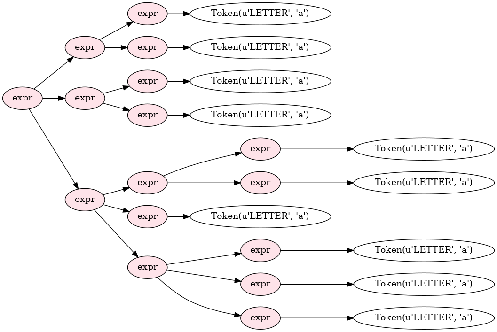
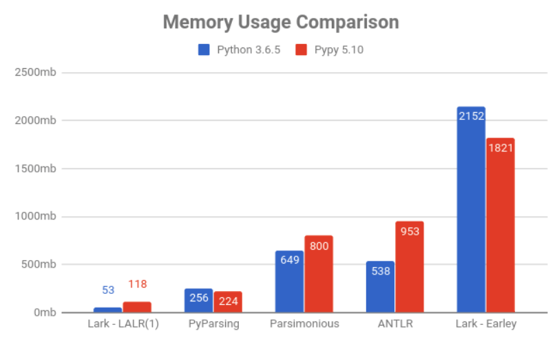

### Установка
```
python3
pip install lark --upgrade
```
### Github
[тык](https://github.com/lark-parser/lark)
### Описание функциональности
`lark` -- это набор инструментов синтаксического анализа для `Python`, способный парсить любые контекстно свободные языки.
 Чтобы использовать в своем проекте `lark` нужно всего лишь добавить строчку `from lark import Lark`.
Некорректно говорить, что `lark` работает на парсере `X` и лексере `Y`, потому что в зависимости
от ваших нужд вы можете подключить один из парсеров -- `Earley`, или `LALR(1)`, или `CYK` и использовать несколько лексеров.
Вот так можно подключить `Earley`:  
``
parser = Lark(grammar, start="expr", parser ="earley")
``   

А вот так `LALR(1)`:  
``
parser = Lark(grammar, start="expr", parser ="lalr")
``   

А еще есть `CYK` :
``
parser = Lark(grammar, start="expr", parser ="cyk")
``
### Earley
Данный парсер основан на алгоритме Jay Earley. Основным его преимуществом является распознавание любой контекстно-свободной грамматики, в том числе неоднозначной. Ниже представлены данные о времени работы для грамматики `S -> SS|SSS|a`

Размер ввода | Время работы (sec)
--- | --- 
1 |  0.000185012817383
11 | 0.0077850818634
21 | 0.0418789386749
31 | 0.115521907806
41 | 0.259844064713
51 | 0.497344017029
61 | 0.886875152588
71 | 1.31989097595
81 | 2.05655694008 
91 | 2.86263990402
101 | 4.14580512047

Грамматика неоднозначная, с на ней `Earley` успешно справляется и работает в общем случае за кубическое время. В случае с однозначными всё чуть получше -- мы получаем квадрат

### LALR(1)
Если же вы вам важно время, то вы можете переключиться на  `LALR(1)`, он пошустрее. Пример для языка `S -> aS | a`:

```
number of a: 10 
 Earley parser --> 0.00121402740479 seconds 
Lalr parser --> 0.00028395652771 seconds
 
number of a: 100 
 Earley parser --> 0.0651278495789 seconds 
Lalr parser --> 0.00073504447937 seconds
 
number of a: 1000 
 Earley parser --> 24.207887888 seconds 
Lalr parser --> 0.00907111167908 seconds
```

Но в неоднозначности он не умеет... Для языка `S -> SS|SSS|a` получаем:

```
lark.exceptions.GrammarError: Reduce/Reduce collision in Terminal(u'LETTER') between the following rules:
- <expr : expr expr expr>
- <expr : expr expr>
Reduce/Reduce collision in Terminal('$END') between the following rules:
- <expr : expr expr expr>
- <expr : expr expr>
```

### CYK 
Данный парсер с практической точки зрения является одним не лучших для разбора любой контекстно-свободной грамматики
за приемлемое время (в худшем случае за `O(n^3*|G|)`, где `|G|` -- размер грамматики). На практике время хуже, чем у `earley` (язык ``S->SS|SSS|a``)


Размер ввода | Время работы (sec)
--- | --- 
1 |  000239133834839
11 | 0.00579810142517
21 | 0.0494251251221
31 | 0.171337842941
41 | 0.420851945877
51 | 0.837104082108
61 | 1.43934893608
71 | 2.3062069416
81 | 3.44750714302
91 | 4.94948101044
101 | 6.79764795303

### Деревья вывода

Помимо всего прочего `lark` умеет строить деревья вывода для грамматики. Например для `aaaaaaaaaa` 
и языка `S->SS|SSS|a`



### Статистика времени работы и памяти




